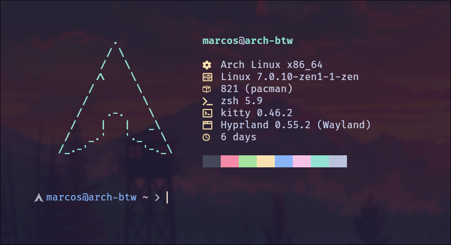

<div align="center">

## My Arch Linux -- Dotfiles

That's just my simple Arch Linux setup! \
Here's how do I set my things, feel free to use or modify!



</div>

## Installation

```bash
bash <(curl https://raw.githubusercontent.com/marcos-dionisio/dotfiles/refs/heads/main/.local/share/dotfiles/install.bash)
```
